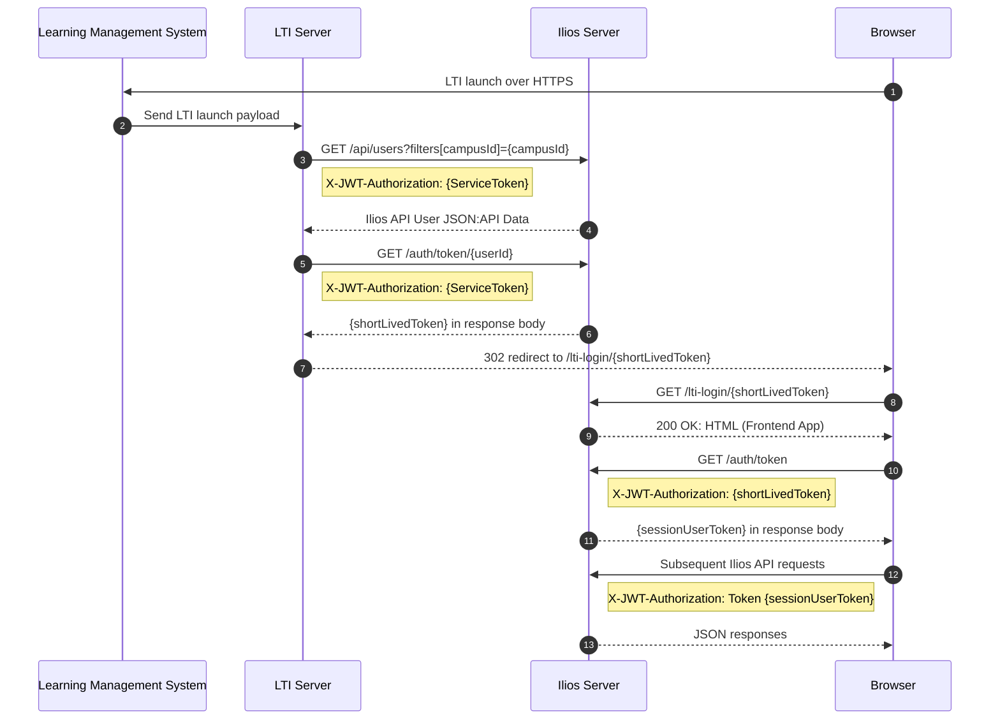

# LTI Launch Data Flow

This process starts with an LMS-initiated LTI 1.3 launch using the OIDC data flow. The LTI server then calls the Ilios API with a service token to resolve the user and obtain a short-lived login token, redirects the browser into the Ilios frontend, and exchanges that token for a session token. After login, the browser makes subsequent Ilios API requests using the session token and receives standard JSON:API responses.

